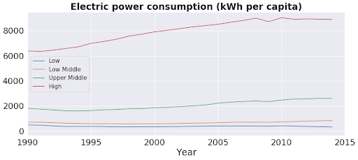
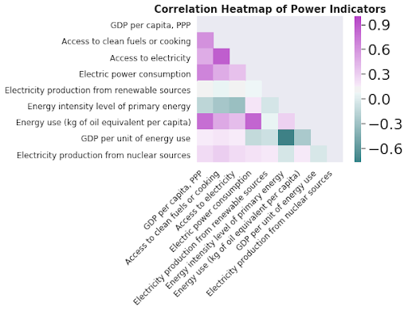

# World Development Indicators: Income and Power

## Scope and Purpose
  Understanding the world, the way and why it functions, is foundational to determining international strategy for any company. Data regarding World Development Indicators (WDI) compiled by the World Bank, provides insightful illustrations of the emerging world and economic development trajectories. 
  Ubiquitous features of industrilized society are the confluence of relative wealth with energy production and usage. It is a common assumption that wealthier countries will have greater access to electricity, higher production of electricity, as well as higher consumption of electricity. It is the scope of this Exploratory Data Analysis (EDA) to investigate these relationships and others. These insights can inform where, when and what kind of energy production is warranted around the globe. 

## Overview
  Data was initially organized according to each country's Gross National Income (GNI) bracket. The means were derived for each bracket according to identifiers of interest and compared over timelines of available data. Boxplots for the distributions of these performances were generated according to year and these provide good cross-sectional snapshots of acute similarity or difference for the indicator in question. A correlational heatmap for select power generation and consumption indicators was constructed along with the Global National Product (GDP) Purchase Power Parity (PPP) for each country in oder to substantiate the relationship of a nation's relative income to said indicators. 

## Conclusions
  There is a definite trend of positive correlation between country income (GDP,PPP) and power production and consumption metrics. However there is an inverse correlation between GDP, PPP and per unit energy consumed, indicating that the efficacy and distribution of energy production is less prioritized in industrialized societies. This may be additionally substantiated by the inverse correlation between ‘GDP per unit of Energy Use’ and ‘Energy Intensity Level of Primary Energy.' 
  

Note: The code contained within the .ipynb can be applied to scrutiny of any indicators. 
